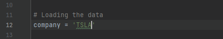
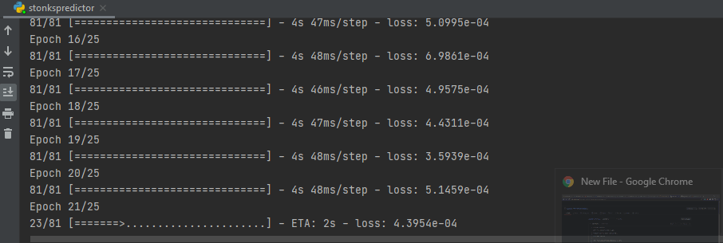
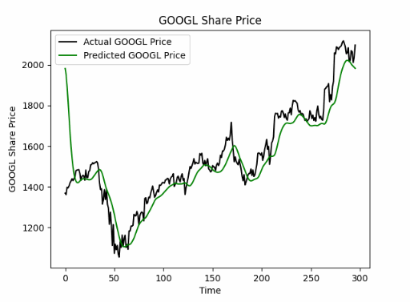

# StockPricePredictor

Stock Price Predictor written in Python

Basically enter the company's ticker symbol : 

Enter the starting and ending date to analyze data :

Wait until training process is done:

Here are some of our predictions for based on the date we analyzed:

